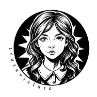

<!-- Improved compatibility of back to top link: See: https://github.com/othneildrew/Best-README-Template/pull/73 -->

<!-- PROJECT LOGO -->
 

  

  <h3 align="center">README Document</h3>

  

    The document with all the most important information about the project.
     
     
    <a href="https://github.com/Trusevirina/trusevirina.com/blob/main/README.md"><strong>For more details, the document is here »</strong></a>
     
     
    <a href="https://github.com/othneildrew/Best-README-Template">Original Template</a>
    &middot;
    <a href="#">Report Bug</a>
    &middot;
    <a href="#">Request Feature</a>
  

<!-- TABLE OF CONTENTS -->

  
Main Sections

  <ol>
    <li>
      <a href="#about-the-project">About the Project</a>
      <ul>
        <li><a href="#key-features">Key Features</a></li>
        <li><a href="#built-with">Built With</a></li>
      </ul>
    </li>
    <li><a href="#report-bug">Report Bug</a>
      <ul>
        <li><a href="#how-to-submit-a-bug-report">How to Submit a Bug Report</a></li>
        <li><a href="#bug-report-structure">Bug Report Structure</a></li>
        <li><a href="#example-bug-report">Example Bug Report</a></li>
      </ul>
    </li>
    <li><a href="#requested-feature">Requested Feature</a>
      <ul>
        <li><a href="#how-to-submit-a-feature-proposal">How to Submit a Feature Proposal</a></li>
        <li><a href="#feature-proposal-structure">Feature Proposal Structure</a></li>
        <li><a href="#example-feature-proposal">Example Feature Proposal</a></li>
      </ul>
    </li>
    <li><a href="#roadmap--todo">Roadmap / TODO</a></li>
    <li><a href="#license">License</a></li>
    <li><a href="#-contact">📬 Contact</a></li>
    <li>
      <a href="#acknowledgments">Acknowledgments</a>
      <ul>
        <li><a href="#youtube">YouTube</a></li>
      </ul>
    </li>
  </ol>

<!-- ABOUT THE PROJECT -->
## About The Project

[![Product Name Screen Shot][product-screenshot]](https://trusevirina.github.io/trusevirina.com/)

**TRUSEVIRINA.COM** is a personal website created entirely from scratch by Taylor Turner.  
The site serves as a hub for original content, including blog posts, articles, resources, and multimedia creations.  

This project was inspired by the desire to share ideas, experiments in creativity, and carefully curated resources with a wider audience, while maintaining a unique and personal style.  

### Key Features:
- A fully custom-built static website, designed and coded from the ground up  
- Sections for blog posts, news, writing, and downloadable resources  
- Personal portfolio and contact information  
- Original graphics, images, and content fully owned by the author  

The website is designed for visitors interested in creative writing, web design experimentation, and original multimedia content.

### Built With

This website has been crafted entirely from scratch using a combination of standard web technologies:

- **HTML** – provides the structural backbone of the site, with all pages saved as `.html` files.  
- **CSS** – responsible for the visual design and layout, contained in a single stylesheet (`style.css`) that shapes the site's aesthetic.  
- **JavaScript** – used selectively to enhance interactivity, powering small widgets and special functions directly embedded in the `.html` files.  

Every element, from the layout and graphics to the content and interactive features, has been designed and implemented personally by the author.  
This project reflects both creative design choices and careful technical implementation, demonstrating a complete, self-contained approach to building a static website.

(<a href="#readme-top">back to top</a>)

<!-- REPORT BUG -->
## Report Bug

If you encounter a bug or issue on **TRUSEVIRINA.COM**, please follow this guide to report it. Proper reporting helps fix problems faster and keeps the project stable.

### How to Submit a Bug Report

1. Go to the <a href="https://github.com/Trusevirina/trusevirina.com/issues">page</a> where the bug occurs.  
2. Check whether the bug has already been reported and/or resolved.  

You have two possible situations:

**A. The bug has been reported but not yet resolved (and it is disruptive):**  
1. Click on **New Issue**.  
2. Select the labels: `DUPLICATE` & `BUG`.  
3. Fill in the issue text following the structure below.

**B. The bug has not been reported:**  
1. Click on **New Issue**.  
2. Select the label: `BUG`.  
3. Fill in the issue text following the structure below.

---

### Bug Report Structure

**Describe the bug**  
> A clear and concise description of what the bug is.

**Steps to reproduce**  
> Steps to reproduce the behavior.

**Expected behavior**  
> A clear and concise description of what you expected to happen.

**Environment**  
> - OS: [e.g. Windows 10, macOS, Arch Linux]  
> - Browser or other relevant details

**Additional context**  
> Add any other context about the problem here.

---

### Example Bug Report

**Describe the bug**  
> The slideshow in the Gallery section does not advance automatically.

**Steps to reproduce**  
> 1. Open the Gallery page  
> 2. Observe the slideshow  

**Expected behavior**  
> The slideshow should automatically change slides every 5 seconds.  

**Environment**  
> - OS: Windows 11  
> - Browser: Chrome 115.0.5790  

**Additional context**  
> The issue does not appear on Firefox.  

(<a href="#readme-top">back to top</a>)

<!-- Requested Feature -->
## Requested Feature

If you have an idea for a new feature or improvement for **TRUSEVIRINA.COM**, please follow this guide to submit it. Properly structured proposals help prioritize enhancements and keep the project organized.

### How to Submit a Feature Proposal

1. Go to the <a href="https://github.com/Trusevirina/trusevirina.com/issues">page</a> where the feature would be relevant.  
2. Check if the feature has already been proposed.  
3. Click on **New Issue**.  
4. Select the label: `ENHANCEMENT`.  
5. Fill in the issue text following the structure below.

---

### Feature Proposal Structure

**Summary**  
> A brief explanation of the feature.

**Basic example**  
> Include a basic example, screenshots, or links here.

**Motivation**  
> Explain why this feature is useful. What use cases does it support? What is the expected outcome?

---

### Example Feature Proposal

**Summary**  
> Add a "Back to Top" button that appears when scrolling down the page.

**Basic example**  
> A small floating button in the bottom-right corner; clicking it scrolls the page to the top.  

**Motivation**  
> This feature improves user navigation and accessibility, especially for long pages with lots of content.

(<a href="#readme-top">back to top</a>)

<!-- ROADMAP -->
## Roadmap / TODO

The following list represents tasks, features, and content to be added or completed for **TRUSEVIRINA.COM** before moving beyond the "pre-phase".  
The development of the site is divided into evolving phases:

- **ALPHA** – Initial website structure  
- **BETA** – Final improvements, including widgets and optional integration with external services  
- **GAMMA** – Multi-language support (English as main language)  
- **DELTA** – Full site functionality  
- **EPSILON** – Stabilization and testing, including publishing 5 posts per language  

These objectives are **potential and flexible**: items may be removed, modified, or new ones added at any time. This is a **living checklist** reflecting ongoing development.

---

- [x] Create website structure
- [ ] Develop all site pages:
    - [ ] Home **IN PROGRESS**
    - [ ] Blog
    - [ ] About
    - [ ] Contact
    - [ ] Resources & Download
    - [ ] Newsletter
- [ ] Integrate JavaScript widgets for small interactive features:
    - [ ] Counters and timers
         - [ ] Local visit counter (using `localStorage`)
         - [ ] Timer / countdown (events, offers, launches)
         - [x] Digital or analog clock (user local time)
         - [ ] Stopwatch
         - [ ] User counter
    - [ ] Animations and visual effects
         - [ ] Scroll progress bar
         - [ ] Text animations (typing effect, letters appear sequentially)
         - [ ] Hover effects on buttons, images, or divs
    - [ ] Galleries and images
         - [ ] Slideshow / carousel
         - [ ] Lightbox (click to enlarge with overlay)
         - [ ] Dynamic grids (masonry layout, local filtering)
         - [ ] Tabbed galleries (category-based)
    - [ ] Dynamic text and content
         - [ ] Random quotes / phrases
         - [ ] Accordion for hidden content
         - [ ] Tabs for organizing information
    - [ ] Forms and user interaction
         - [ ] Local search fields
         - [ ] Tooltips and informative popups
    - [ ] Charts and data
         - [ ] Local charts and diagrams (Chart.js, Canvas API)
         - [ ] Progress / level / completion indicators
    - [ ] Social widgets / light interactivity
         - [ ] Local likes / ratings (`localStorage`)
         - [ ] Local voting system (“How much do you like this article?”)
         - [ ] Local bookmarks / favorites
    - [ ] Miscellaneous useful widgets for static sites
         - [ ] PDF generator / local print
         - [ ] Local conditions display (local time, timezone)
         - [ ] Word / character counter (for blog or online writing)
- [ ] Add 2 posts per Blog section:
    - [ ] Articles
    - [ ] Diary
    - [ ] Posts (general)
    - [ ] Writing
    - [ ] Updates
- [ ] Multi-language Support
    - [ ] English
    - [ ] Italian
    - [ ] Russian

See the [open issues](https://github.com/Trusevirina/trusevirina.com/issues) for a full list of proposed features (and known issues).

(<a href="#readme-top">back to top</a>)

<!-- LICENSE -->
## License

This project and all its content are the **exclusive property of Karina Truseviciute**. See `LICENSE.MD` (<a href="LICENSE.md">LINK</a>) for more information.

(<a href="#readme-top">back to top</a>)

<!-- CONTACT -->
## 📬 Contact

- 🌐 [Website](https://trusevirina.github.io/trusevirina.com/)  
- 💼 [LinkedIn](https://www.linkedin.com/in/karina-truseviciute/)
- 📱 [Telegram](https://t.me/KarinaTruseviciute)
- ✉️ [Email](mailto:truseviciute.karina&#64;gmail&#46;com)

(<a href="#readme-top">back to top</a>)

<!-- ACKNOWLEDGMENTS -->
## Acknowledgments

Here I share resources—videos, documents, and other materials—that have personally helped me and that I’d like to give credit to. A few of my favorites are listed below to kick things off!

* [Create a `readme.md` files](https://github.com/othneildrew/Best-README-Template/blob/main/README.md)

### Youtube
* [How to put an HTML website online (on the Internet), SuperSimpleDev](https://www.youtube.com/watch?v=p1QU3kLFPdg)
* [How to Use GitHub Pages in 2025! (Beginner's Guide), The Common Coder](https://www.youtube.com/watch?v=5XhxR9Vs6zc)
* [HTML FOR DUMMIES | NEOCITIES TUTORIAL, Magoonka](https://www.youtube.com/watch?v=V1BqNbckZYg) (great code review)
* [What is GitHub? GitHub](https://www.youtube.com/watch?v=pBy1zgt0XPc)

  

(<a href="#readme-top">back to top</a>)

<!-- MARKDOWN LINKS & IMAGES -->
<!-- https://www.markdownguide.org/basic-syntax/#reference-style-links -->
[product-screenshot]: img2/screenshot.webp
[Next.js]: https://img.shields.io/badge/next.js-000000?style=for-the-badge&logo=nextdotjs&logoColor=white
[Next-url]: https://nextjs.org/
[React.js]: https://img.shields.io/badge/React-20232A?style=for-the-badge&logo=react&logoColor=61DAFB
[React-url]: https://reactjs.org/
[Vue.js]: https://img.shields.io/badge/Vue.js-35495E?style=for-the-badge&logo=vuedotjs&logoColor=4FC08D
[Vue-url]: https://vuejs.org/
[Angular.io]: https://img.shields.io/badge/Angular-DD0031?style=for-the-badge&logo=angular&logoColor=white
[Angular-url]: https://angular.io/
[Svelte.dev]: https://img.shields.io/badge/Svelte-4A4A55?style=for-the-badge&logo=svelte&logoColor=FF3E00
[Svelte-url]: https://svelte.dev/
[Laravel.com]: https://img.shields.io/badge/Laravel-FF2D20?style=for-the-badge&logo=laravel&logoColor=white
[Laravel-url]: https://laravel.com
[Bootstrap.com]: https://img.shields.io/badge/Bootstrap-563D7C?style=for-the-badge&logo=bootstrap&logoColor=white
[Bootstrap-url]: https://getbootstrap.com
[JQuery.com]: https://img.shields.io/badge/jQuery-0769AD?style=for-the-badge&logo=jquery&logoColor=white
[JQuery-url]: https://jquery.com 
